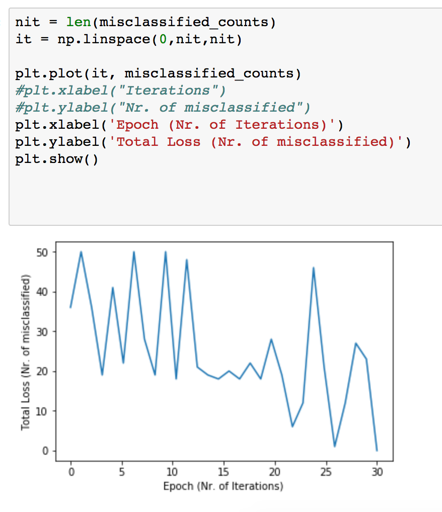

# Practical work 01

- Benjamin Kühnis (bkuehnis@hsr.ch)
- Jetmir Bajramoski (jetmir.bajramoski@students.bfh.ch)
- Gregory Banfi (banfigre@students.zhaw.ch)

## Exercise 3 Perceptron Learning Algorithm
After 30 iterations (epochs) we had no more missclasified lables. For more information see <a href='https://github.com/suizo12/TSM_DeLearn'>github repo</a>.

 

 
 
 ## Exercise 4
 see <a href='https://github.com/suizo12/TSM_DeLearn/blob/master/work01/iris.py'> iris data generator</a>
 
 
 ## Exercise 5
 ### Supervised (s) vs. unsupervised systems (us)
- Given email labeled as spam/not spam, learn a spam filter. (s)
   Because the program can classify as spam some email adresses and cause the loss of important information.
- Given a set of news articles found on the web, group them into sets of related articles. (us)
   Because it's possibile to create specific rules to group the articles.
- Given a database of customer data, automatically discover market segments and group customers into different market segments. (us)
   Because the segmentation can be done based on objective information.
- Given a dataset of patients diagnosed as either having glaucoma or not, learn to classify new patients as having glaucoma or not. (s)
   In the medical sector it's always good to have a system Supervised because of the big responsability.

### Classification vs. regression systems
Can we transform a regression problem into a classification problem? What would be the benefits of doing so ?
Yes, use regression and then divide the results in the different classes. The benefit is, that the division can be done arbitrary.
For example the reggression gives result between [0, 10] the classification could be done all smaller than 2 and the rest. 

### Perceptron
- For what kind of problems are Perceptrons suited ?
- For problems which the data can be splitted in a straight line.
— For what kind of problems will the Perceptron Learning Algorithm converge?
- Clear distinguished groups of data. 
— Give an example for which the Perceptron Learning Algorithm will not converge. Explain
why not.
    - When the training data has each two groups and those can't be separated by a straight line.
 
 A ----- B 
 |...........| 
 |...........| 
 B ----- A  
 

 ## Exercise 6
 
 
